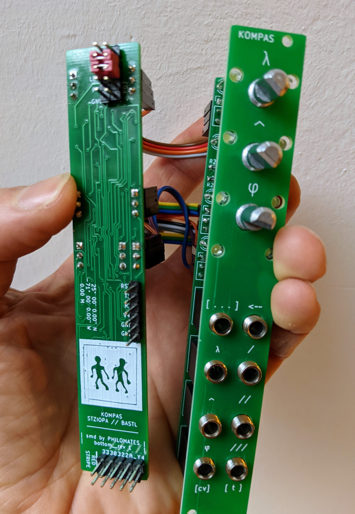
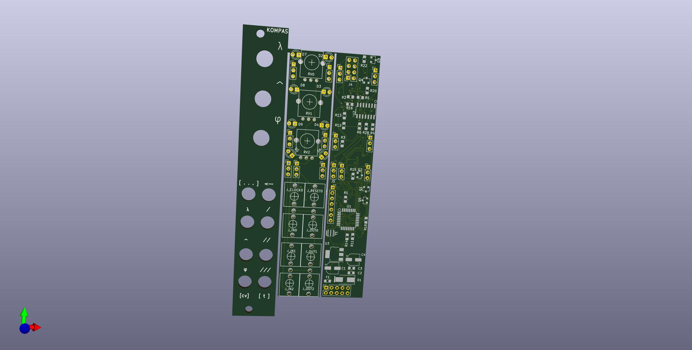
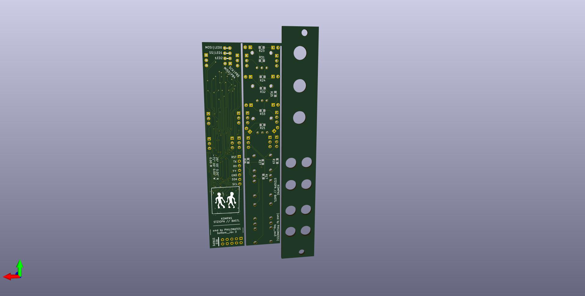

# Cloned from https://git.sr.ht/~philomates/kompas

# SMD version of Bastl Kompas

As an attempt to learn kicad I decided to take the open source Bastl Kompas eurorack module, which is a 5hp through-hole soldering project, and redesign it as a 4hp SMD soldering project.

## Bill of Materials

[Mouser BOM](https://www.mouser.de/ProjectManager/ProjectDetail.aspx?AccessID=1936c8aad0) or find the excel file in this repository.

Parts should come out to be below 20 euros.

## hardware modifications

The SMD version has a different pin mapping which should be described in the code. The reason for this is the following:

### exposing MOSI/MISO/SCK/SS for on-pcb bootloader flashing

With the original Kompas you can take the ATMEGA328 chip, place it on a breadboard, and flash the Arduino bootloader onto it by wiring the MOSI/MISO/SCK/SS pins up to a normal Arduino or another ISP programmer.
With the SMD ATMEGA328-AU chip, you can't put it on a breadboard, so the normal way for flashing these with the arduino bootloader

### exposing SDA/SCL pins as extension pins for integration with sensors

This project is based off the ATMEGA328-AU chip, which has 2 additional analog input pins when compared to the ATMEGA328-P that the Bastl Kompas uses.

### different pins

It is easiest to check the code or schematics. This was done to cleanly expose the ICSP headers and serial pins.

### more exposed pins for extensions

## hardware resources

[schematic found here](schematic.pdf)

The design was done in Kicad. Also provided are the gerber files for PCB fabrication

## alternative firmwares

See `code/` directory.

### window comparator

Essentially an attempt to be half of a Joranalogue 'Compare 2' module. Works alright and the top pot is mapped to a sample rate reduction thing which gives funky results.

### probabilistic latch / burst generator

Dual latch + single burst generator. The latches have probability modulation for likelihood of un/setting.

## CHANGELOG

### rev 3 (untested)

 - fixed up some alignments in the panel (I think)
 - removed second fuse (reducing parts cost by a 1 euro) because few people would use it

### rev 2
 - fixed missing connection issues in rev 1
 - ICSP header pins exposed for bootloader flashing
 - SDA/SCL serial line pins exposed for interfacing with other components

### rev 1
 - direct copy of Bastl version but in SMD.
 - has some bugs that require custom connections after.
 - flashing arduino bootloader requires soldering jumpers straight to SMD components.

## License

The original (Bastl Kompas)[https://github.com/bastl-instruments/kompas] is CC-BY-SA and this work perpetuates that.

Utmost thanks to the original designers for making their work available!
